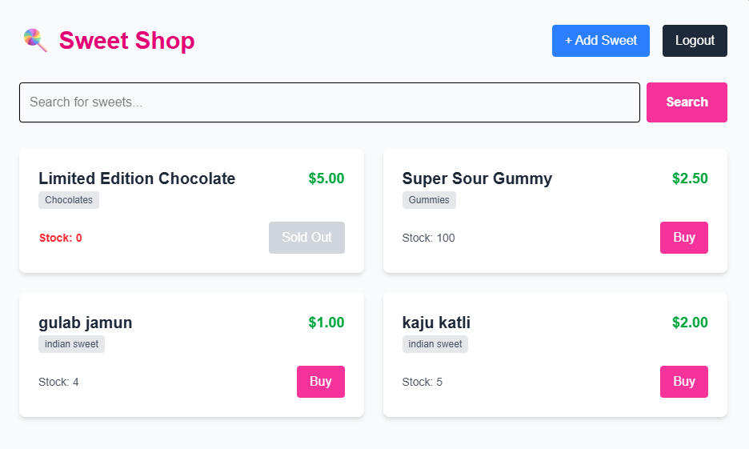
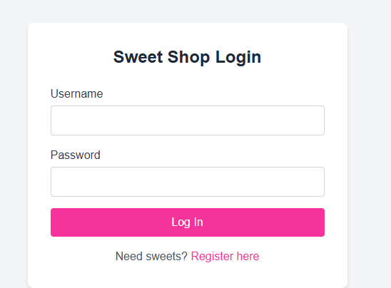
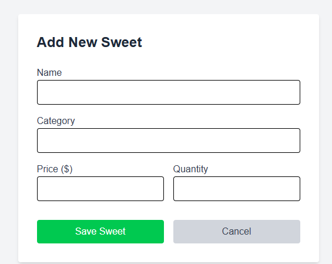
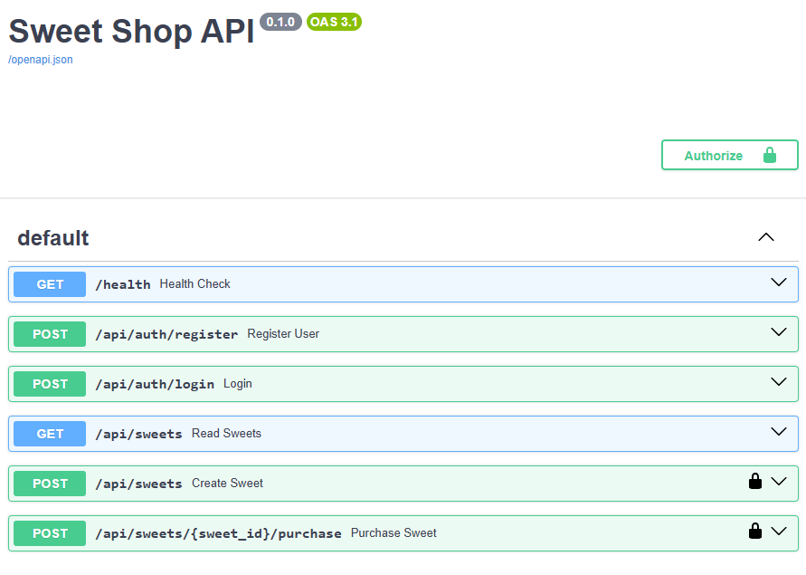

# 🍭 Sweet Shop Management System

A full-stack web application for managing a digital sweet shop. This project demonstrates a modern **Test-Driven Development (TDD)** workflow, featuring a robust **FastAPI (Python)** backend and a responsive **Next.js (TypeScript)** frontend.

## 📋 Table of Contents
* [Features](#-features)
* [Tech Stack](#-tech-stack)
* [Screenshots](#-screenshots)
* [Setup & Installation](#-setup--installation)
* [API Documentation](#-api-documentation)
* [Running Tests](#-running-tests)
* [My AI Usage](#-my-ai-usage)

---

## ✨ Features
* **User Authentication:** Secure Registration and Login with JWT (JSON Web Tokens).
* **Inventory Management:** View, search, and manage a real-time inventory of sweets.
* **Purchasing System:** Users can "buy" sweets, which automatically updates stock levels.
* **Admin Controls:** Dedicated interface to add new sweets to the shop.
* **Search:** Real-time search by name or category.
* **Responsive Design:** Beautiful, mobile-friendly UI built with Tailwind CSS.

---

## 🛠 Tech Stack

### **Backend**
* **Framework:** FastAPI (Python)
* **Database:** SQLite (SQLAlchemy ORM)
* **Authentication:** OAuth2 with Password (Bearer JWT)
* **Testing:** Pytest (TDD Approach)

### **Frontend**
* **Framework:** Next.js 14 (App Router)
* **Language:** TypeScript
* **Styling:** Tailwind CSS
* **HTTP Client:** Axios

---

## 📸 Screenshots

### **1. Dashboard & Inventory**
Users can view all available sweets, see live stock levels, and purchase items. Items with 0 stock are disabled.


### **2. User Login**
Secure login page that issues a JWT for session management.


### **3. Admin: Add New Sweet**
An interface for admins to add new inventory items to the database.


### **4. API Documentation (Swagger UI)**
Interactive API docs automatically generated by FastAPI.


---

## 🚀 Setup & Installation

Follow these steps to run the project locally.

### **Prerequisites**
* Python 3.9+
* Node.js 18+

### **1. Clone the Repository**
```bash
git clone <your-repo-url>
cd sweet-shop